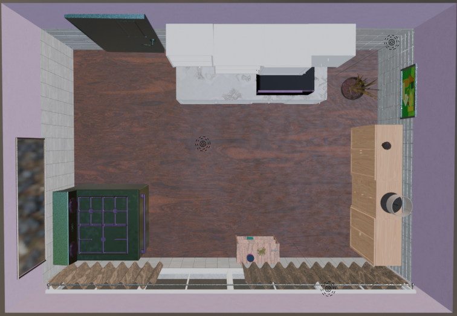
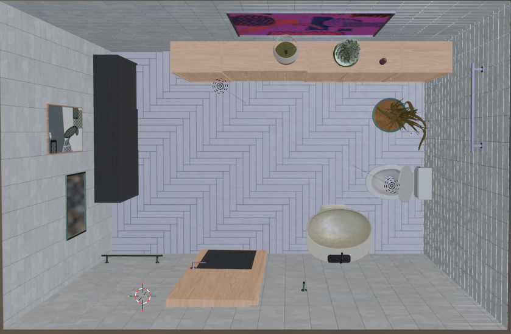
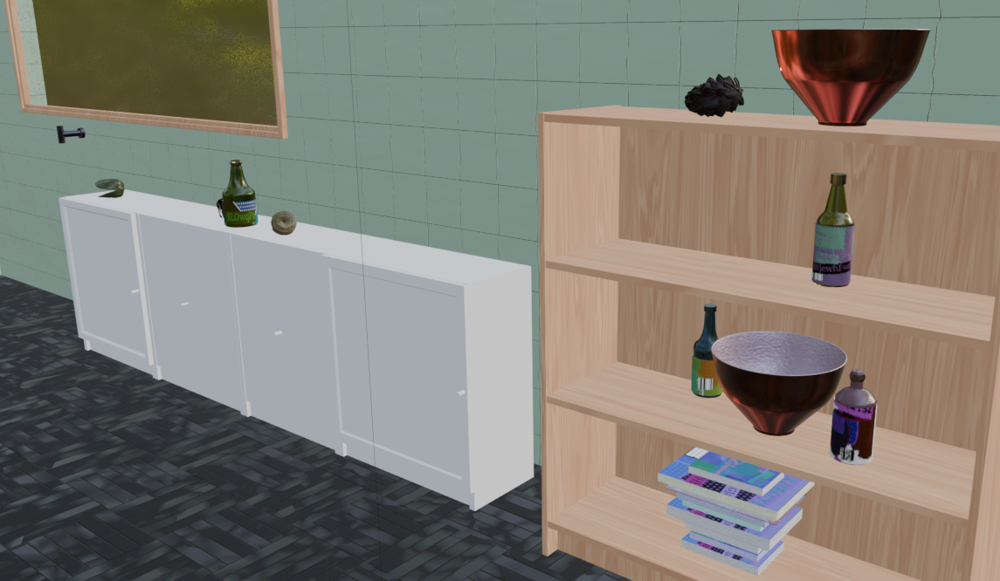
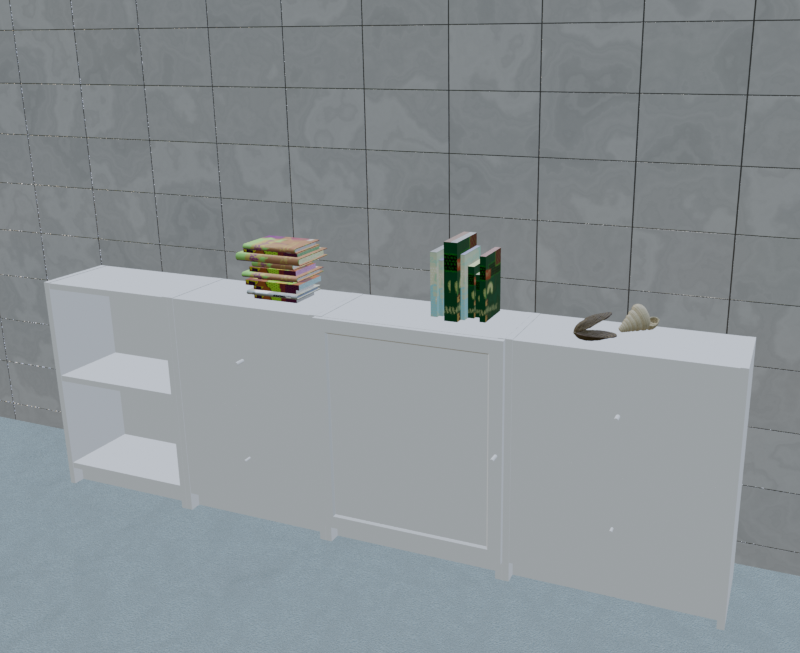
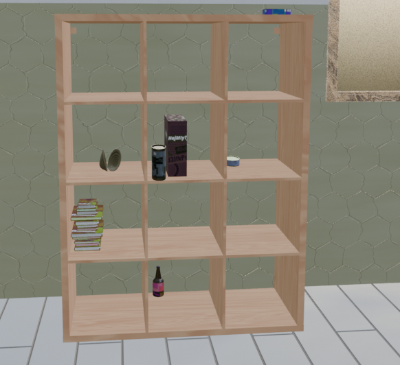
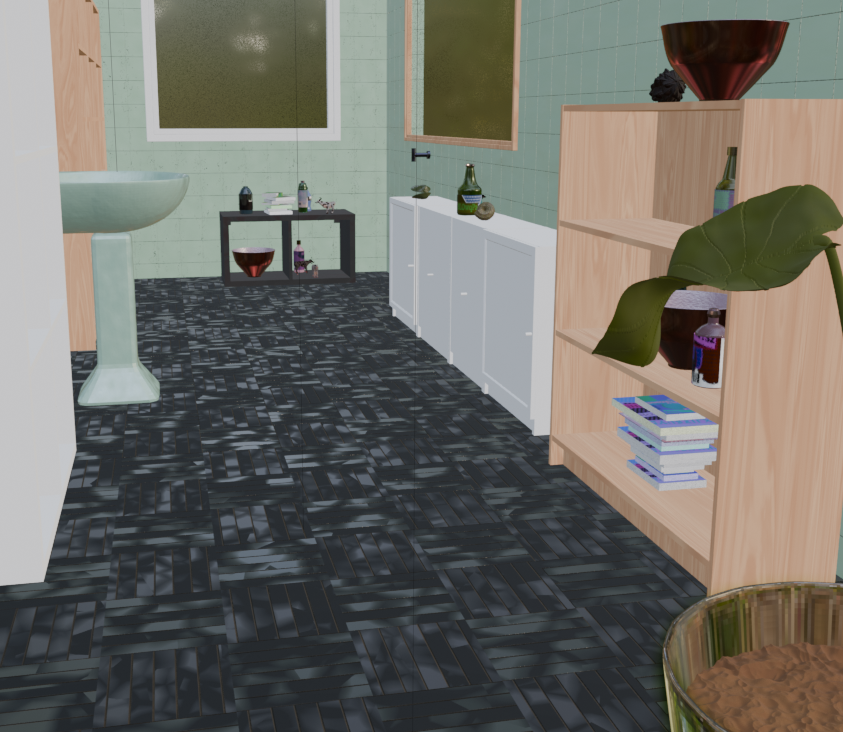
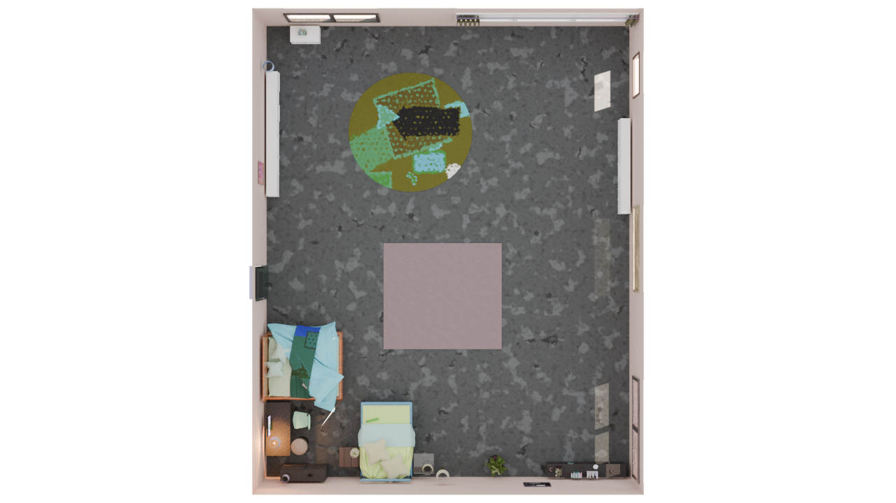
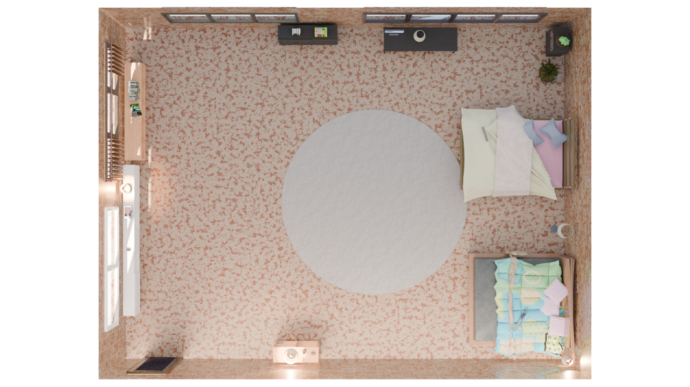
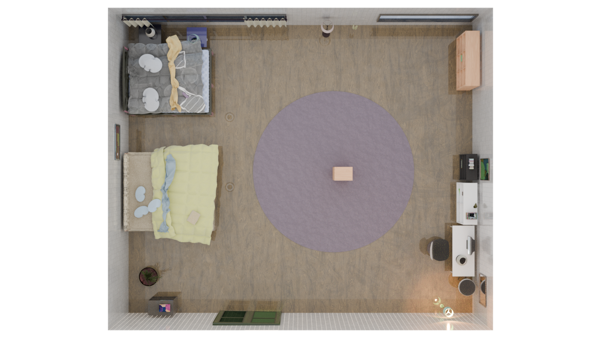

# SSCS-Optimizer: Static Scene Complexity Optimization for Indoor Environments

[](https://www.python.org/downloads/)
[](https://www.blender.org/)
[](https://numpy.org/)
[](LICENSE)

A complexity-aware procedural generator built on top of [Infinigen](https://github.com/princeton-vl/infinigen), enabling controlled generation of indoor scenes with quantifiable static complexity. This project introduces a Bayesian optimization framework that automatically adjusts generation parameters to achieve target Static Scene Complexity Scores (SSCS).

## 🙏 Acknowledgments

This project builds on the work of **Infinigen**, a Blender-based procedural generator developed by Princeton Vision & Learning Lab. Infinigen enables photorealistic indoor scene generation with flexibility. We extend our gratitude to the Infinigen team for open-sourcing their powerful framework, which serves as the foundation for our complexity optimization system.

## 🎯 Project Overview

While Infinigen provides rich control over scene generation through numerous parameters, our work introduces a higher-level abstraction: **generate scenes with a target complexity score**. This is particularly valuable for robotics and navigation research where controlled environment complexity is crucial.

### Key Features

- **Target-driven Generation**: Specify desired SSCS (0-1 scale), get optimized scene
- **Bayesian Optimization**: Automatically tunes 9 key parameters to meet complexity targets
- **Modular Complexity Metrics**: Four independent components with customizable weights
- **Navigation-focused Design**: Optimized for geometric and spatial properties

## 📊 Static Scene Complexity Score (SSCS)

The SSCS quantifies indoor scene complexity through four complementary metrics. Based on the attached guideline, we've adapted the formulation for navigation-centric applications:

### SSCS Component Analysis

| Component | Weight | Calculation Method | Parameters |
|-----------|--------|-------------------|------------|
| **OD (Object Diversity)** | 40% | `0.4*(N_cat/C_max) + 0.3*(N_inst/I_max) + 0.3*R_inter` | `category_diversity_target`<br>`instance_density_target` |
| **LC (Layout Complexity)** | 20% | `0.5*E_spatial + 0.5*D_obj` | `spatial_distribution_spread`<br>`room_utilization_balance` |
| **FP (Functional Properties)** | 20% | `0.8*P_inter + 0.2*(N_itype/T_max)` | `interactive_object_ratio`<br>`interaction_type_diversity` |
| **VD (Visual Diversity)** | 20% | `0.5*(N_mat/M_max) + 0.5*(P_avg/P_max)` | `material_diversity_target`<br>`geometry_complexity_target` |

### Normalization Parameters (examples)

| Parameter | Max Value | Description |
|-----------|-----------|-------------|
| C_max (categories) | 25 | Typical indoor category limit |
| I_max (instances) | 50 | Reasonable instance range |
| S_max (surface area) | 3000 m² | maximal indoor surface area |
| F_max (floor area) | 300 m² | Typical room size maximum |
| T_max (interaction types) | 5 | Common interactions (push/pull/rotate/etc.) |
| M_max (materials) | 10 | Covers mainstream needs |
| P_max (polygons) | 50k | Balances detail and performance |

### Composite Formula

```
SSCS = α·OD + β·LC + γ·FP + δ·VD where we initialize α=0.4, β=0.2, γ=0.2, δ=0.2 emperically.
```

## 🔧 System Architecture

### Parameter Inheritance Chain

```
Command Line --sscs 0.6
    ↓
main(args) → args.sscs = 0.6
    ↓
generate_with_sscs_target(0.6, scene_seed, output_folder)
    ↓
BayesianOptimizer.optimize(0.6, scene_seed, output_folder)
    ↓
compose_indoors(output_folder, scene_seed, target_sscs=0.6, **params)
    ↓
home_constraints.home_furniture_constraints(target_sscs=0.6)
```

### SSCS Computation Flow

```
Scene object (from Infinigen)
    ↓
SSCSCalculator.compute(scene)
    ↓
Extract metrics:
    • category_count() + instance_count() + interactive_ratio() → OD
    • spatial_entropy() + object_density() → LC
    • interactive_properties() → FP
    • material_count() + avg_polygons() → VD
    ↓
Weighted combination → SSCS
```

## 🖼️ Visual Examples: Complexity Variations

### Object Diversity (OD)
<div align="center">
  <table>
    <tr>
      <td><b>Low OD</b></td>
      <td><b>Medium OD</b></td>
      <td><b>High OD</b></td>
    </tr>
    <tr>
      <td></td>
      <td></td>
      <td></td>
    </tr>
  </table>
</div>

### Instance Density
<div align="center">
  <table>
    <tr>
      <td><b>Low Instances</b></td>
      <td><b>Medium Instances</b></td>
      <td><b>High Instances</b></td>
    </tr>
    <tr>
      <td></td>
      <td></td>
      <td></td>
    </tr>
  </table>
</div>

### Spatial Entropy (LC)
<div align="center">
  <table>
    <tr>
      <td><b>Low Entropy</b></td>
      <td><b>Medium Entropy</b></td>
      <td><b>High Entropy</b></td>
    </tr>
    <tr>
      <td></td>
      <td></td>
      <td></td>
    </tr>
  </table>
</div>

## 🚀 Getting Started

### Prerequisites
- Python 3.8+
- Blender 3.0+
- Infinigen (follow their [installation guide](https://github.com/princeton-vl/infinigen))

### Installation

```bash
# Clone this repository
git clone https://github.com/yourusername/SSCS-Optimizer.git
cd infinigen-sscs

# Install dependencies
pip install -r requirements.txt

# Ensure Infinigen is properly installed and configured
export INFINIGEN_ROOT=/path/to/infinigen
```

### Basic Usage

```bash
# Generate a scene (DiningRoom for example) with target SSCS 0.5
python -m infinigen_examples.generate_indoors --sscs 0.5 --task coarse --output_folder outputs/indoors/sample -g fast_solve.gin singleroom.gin -p compose_indoors.terrain_enabled=False restrict_solving.restrict_parent_rooms=\[\"DiningRoom\"\]

# Generate scenes with multiple rooms
python -m infinigen_examples.generate_indoors --task coarse --sscs 0.5 --output_folder outputs/indoors/sample -g fast_solve.gin overhead.gin -p compose_indoors.terrain_enabled=False compose_indoors.invisible_room_ceilings_enabled=True

### Customizing Complexity Metrics

The system is designed for flexibility. You can easily adapt it to your research needs:
```

## 📚 Citation

If you use this work in your research, please cite:

```bibtex
@software{sscs_optimizer2026,
  title = {SSCS_Optimizer: Static Scene Complexity Optimization for Indoor Environments},
  author = {dynamics986},
  year = {2026},
  url = {https://github.com/dynamics986/SSCS_Optimizer}
}
```

## 📄 License

This project is licensed under the MIT License - see the [LICENSE](LICENSE) file for details.

## 🤝 Contributing

Contributions welcome! Please feel free to submit a Pull Request.

## ⚠️ Note
This project modifies Infinigen's generation pipeline to incorporate complexity optimization. While we maintain compatibility with core Infinigen features, some advanced Infinigen parameters may be overridden during optimization.

